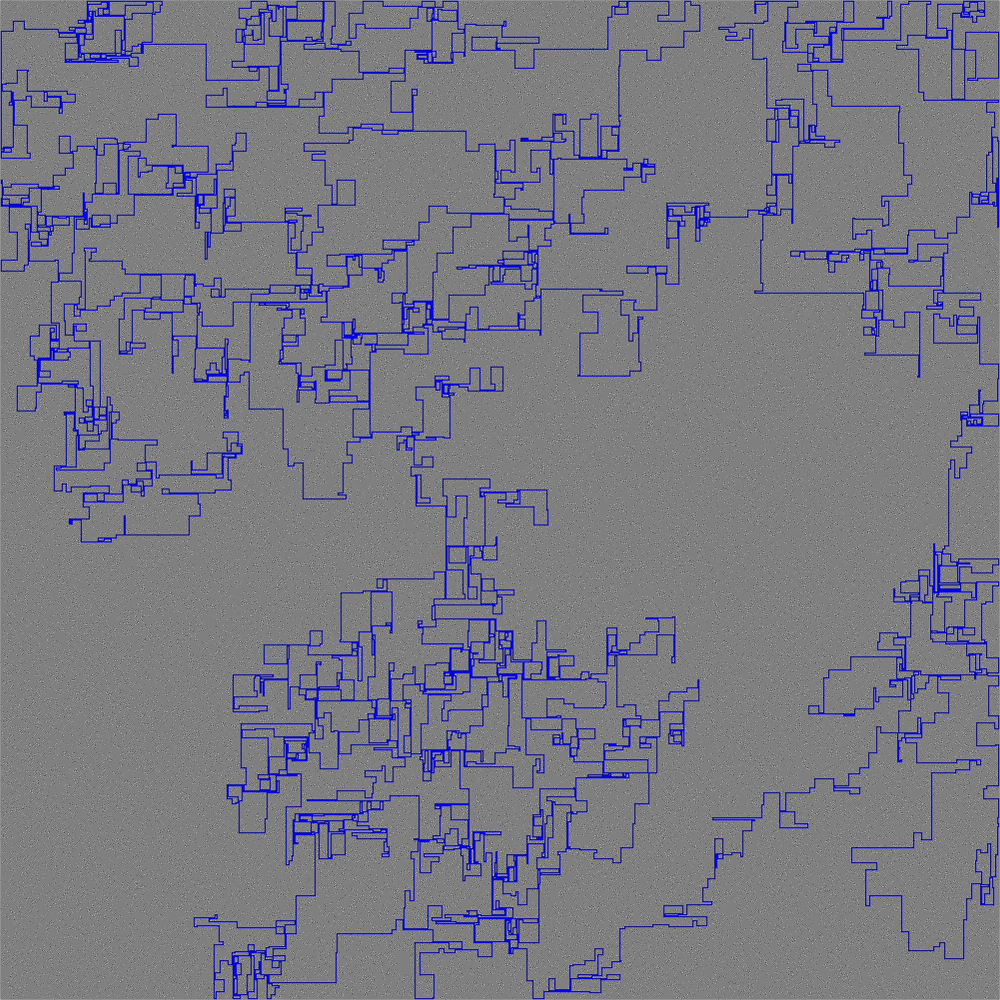

## Maze Solver

A Go program that takes an image of a maze, solves it, and writes a new image with the solution drawn on top of the original maze.

This program is not robust... It requires the images to be pngs, the maze to be square, and for the maze paths and walls to be a single pixel in size. That means the larger the image, the more complex the maze.

This project was inspired by [this video](https://www.youtube.com/watch?v=rop0W4QDOUI).

---

### Build And Run
First, you have [Go](https://golang.org/dl/) installed, right?

To build, run `bash build.sh`

Now run the executable and provide a path to your maze png:

`./main ./maze_assets/maze_md.png`

The program will save the solution in the maze_assets directory as a file called `solution.png`

---

### Create Mazes

I created the sample mazes on [this site](https://hereandabove.com/maze/mazeorig.form.html). You'll need to set path and wall width to 1. Now, this webapp spits out gif files. I have no idea why it does this, but *this* program expects pngs. So use another site that will convert that file for you. I used [this one](https://www.browserling.com/tools/gif-to-png).

I know it's janky, but the purpose of this project was to solve mazes, not get into image conversions.

---

### Stragegy

#### Which way is up?

`Find the boundaries of the maze`

First we find the top left most dark pixel. From there, as long as the maze is square we can find the other three corners.

`Find the doors`

Now we walk along the walls looking for light colored pixels. There should be two. These are our start/finish points. Below you'll see the program has painted them in green.

---

#### Build a graph

Build n graph using adjacency matrix. It's built using a recursive depth first search algorithm that links neighboring nodes as it decends. But where to place the nodes? At first thought we could place one at each point along the path. But that seems a little unecessary. Why create and link a bunch of nodes down a straight corridor? We really want to create nodes at _decision_ points. The points at which the algorithm has to decide which path to take are critical. So they become nodes in our graph. Those point are marked below in red.

The one other case where I decided to create nodes is where we aren't making a decision per say, but rather rounding a corner. Why? It makes it much, much easier to draw the path at the end if each stroke is a straight line between nodes. This increases the memory overhead of the program, but we still get to omit many of the points in our graph. All the corner points are marked in red below.

Put together with the decision points, our final graph can be visually represented with the following image.

---

#### Solve the Maze

Now that the maze is structured in memory nicely, we can solve it. For this step I used an iterative breadth first search using a queue. But here's the trick: the queue is a *max heap*. This means that each node that gets pushed into the queue has a priority level. That priority is computed using the distance from a node to the maze exit. These nodes will bubble up to the top of the queue in order of priority. That way, we bias our decisions towards paths that are heading in the general direction of the exit. While not always the correct decision, it helps us to find the optimal path should there be more than one solution through the maze. The nodes are marked with a `cameFrom` property that leaves breadcrumbs in the form of pointers to previous nodes along the path. Below I've marked the nodes along the solution path in blue.

Now we can simply start at the `finish` node and walk backwards following our `cameFrom` pointers, painting blue lines along the way.

---

Here's a slightly larger maze

Go big or go home

